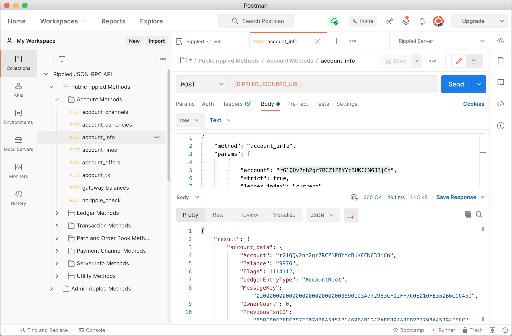

# Rippled Postman Collection

This package provides a Postman Collection to be used with the `rippled` XRP Ledger server.

Example request bodies are used from [https://xrpl.org/rippled-api.html](https://xrpl.org/rippled-api.html).

## Usage

1. Load the [`rippled_postman_collection.json`](rippled_postman_collection.json) file into your Postman client.
1. Set the environment variable `RIPPLED_JSONRPC_URL` to your `ripppled` server's address, e.g. `https://xrpl.ws/` for the XRP Ledger Foundation server.
1. Navigate to your collection and try some APIs!

## Status

1. Many of the Public Read APIs hvae been implemented already
1. Trasaction APIs still need to be completed
1. Polymorphic APIs still need to be completed, e.g. `account_objects`, `ledger_entry`
1. Admin APIs still need to be completed

## API Support

- [ ] Public rippled Methods
  - [ ] Account Methods
    - [x] `account_channels` - Get a list of payment channels where the account is the source of the channel.
    - [x] `account_currencies` - Get a list of currencies an account can send or receive.
    - [x] `account_info` - Get basic data about an account.
    - [x] `account_lines` - Get info about an account's trust lines.
    - [ ] `account_objects` - Get all ledger objects owned by an account.
    - [x] `account_offers` - Get info about an account's currency exchange offers.
    - [x] `account_tx` - Get info about an account's transactions.
    - [x] `gateway_balances` - Calculate total amounts issued by an account.
    - [x] `noripple_check` - Get recommended changes to an account's Default Ripple and No Ripple settings.
  - [ ] Ledger Methods
    - [x] `ledger` - Get info about a ledger version.
    - [x] `ledger_closed` - Get the latest closed ledger version.
    - [x] `ledger_current` - Get the current working ledger version.
    - [x] `ledger_data` - Get the raw contents of a ledger version.
    - [ ] `ledger_entry` - Get one element from a ledger version.
  - [ ] Transaction Methods
    - [ ] `sign` - Cryptographically sign a transaction.
    - [ ] `sign_for` - Contribute to a multi-signature.
    - [ ] `submit` - Send a transaction to the network.
    - [ ] `submit_multisigned` - Send a multi-signed transaction to the network.
    - [ ] `transaction_entry` - Retrieve info about a transaction from a particular ledger version.
    - [ ] `tx` - Retrieve info about a transaction from all the ledgers on hand.
    - [ ] `tx_history` - Retrieve info about all recent transactions.
  - [x] Path and Order Book Methods
    - [x] `book_offers` - Get info about offers to exchange two currencies.
    - [x] `deposit_authorized` - Check whether an account is authorized to send money directly to another.
    - [ ] ~`path_find` - Find a path for a payment between two accounts and receive updates. (websocket only)~
    - [x] `ripple_path_find` - Find a path for payment between two accounts, once.
  - [ ] Payment Channel Methods
    - [ ] `channel_authorize` - Sign a claim for money from a payment channel.
    - [ ] `channel_verify` - Check a payment channel claim's signature.
  - [x] Server Info Methods
    - [x] `fee` - Get information about transaction cost.
    - [x] `manifest` - Look up the public information about a known validator.
    - [x] `server_info` - Retrieve status of the server in human-readable format.
    - [x] `server_state` - Retrieve status of the server in machine-readable format.
  - [x] utility Methods
    - [ ] ~`json` - Pass JSON through the commandline.~ (commandline only)
	- [x] `ping` - Confirm connectivity with the server.
    - [x] `random` - Generate a random number.
- [ ] Admin rippled Methods
  - Key Generation Methods
    - [ ] `validation_create` - Generate keys for a new rippled validator.
    - [ ] `wallet_propose` - Generate keys for a new account.
  - [ ] Logging and Data Management Methods: Use these methods to manage log levels and other data, such as ledgers.
    - [ ] `can_delete` - Allow online deletion of ledgers up to a specific ledger.
    - [ ] `crawl_shards` - Request information about which history shards peers have.
    - [ ] `download_shard` - Download a specific shard of ledger history.
    - [ ] `ledger_cleaner` - Configure the ledger cleaner service to check for corrupted data.
    - [ ] `ledger_request` - Query peer servers for a specific ledger version.
    - [ ] `log_level` - Get or modify log verbosity.
    - [ ] `logrotate` - Reopen the log file.
  - [ ] Server Control Methods - Use these methods to manage the rippled server.
    - [ ] `ledger_accept` - Close and advance the ledger in stand-alone mode.
    - [ ] `stop` - Shut down the rippled server.
    - [ ] `validation_seed` - (Obsolete) Temporarily set key to be used for validating.
  - [ ] Peer Management Methods - Use these methods to manage your server's peer-to-peer connections.
    - [ ] `connect` - Force the rippled server to connect to a specific peer.
    - [ ] `peer_reservations_add` - Add a reserved slot for a specific peer server.
    - [ ] `peer_reservations_del` - Remove a reserved slot for a specific peer server.
    - [ ] `peer_reservations_list` - List reserved slots for specific peer servers.
    - [ ] `peers` - Get information about the peer servers connected.
  - [x] Status and Debugging Methods - Use these methods to check the status of the network and server.
    - [x] `consensus_info` - Get information about the state of consensus as it happens.
    - [x] `feature` - Get information about protocol amendments.
    - [x] `fetch_info` - Get information about the server's sync with the network.
    - [x] `get_counts` - Get statistics about the server's internals and memory usage.
    - [ ] ~`print` - Get information about internal subsystems.~ (websocket and command line only)
    - [x] `validator_info` - Get the server's validation settings, if configured as a validator.
    - [x] `validator_list_sites` - Get information about sites that publish validator lists.
    - [x] `validators` - Get information about the current validators.